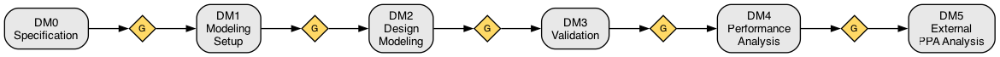
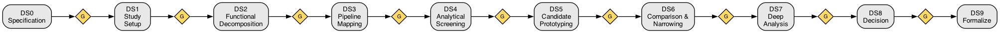

# 1. Available Workflows

## Purpose

Define the available AI workflows for developing hardware architectures.

## Workflows

There are two workflows supported. The Direct Modeling Flow turns a design specification into a cycle accurate model using the Foundation modeling framework. The Design Study Flow supports exploration and selection of a design from multiple candidates.

A workflow consists of the following general components, used slightly differently depending upon the specific flow.

- *Problem*: A problem definition with constraints and success criteria
- *Specification*: A specification document describing what to build
- *Candidates*: A set of candidates to compare
- *Workloads*: A shared workload suite for consistent evaluation
- *Testbench*: A comparison framework and decision record
- *Tracking*: Cross-candidate experiment tracking

Every project uses the study infrastructure for experiment tracking and decision records, even when there is only one candidate.

## Direct Modeling Flow

Use the *Direct Modeling Flow* when you already know what you want to build and want to create a cycle accurate model for it without the need to explore your options. The following sections describe the flow. Keep in mind that the flow is generally linear but steps can be reentered at any time as results necessitate.



For the Direct Modeling Flow, the workflow components are used as follows:

- *Problem* is predefined as "Build the requested model from the specification."
- *Specification* is per DM0 below
- *Candidates* is the single model to be developed
- *Workloads* and *Testbench* are as defined in DM1 and DM3
- *Tracking* is the common experiment tracking mechanism

### DM0: Specification

The *specification* is the entry point for modeling. It must specify a clock frequency, technology node, a detailed functional description, internal and external interfaces, pipelining and hierarchy for the design. If the model needs to be parameterizable, the specification should identify what features of the design can be parameterized.

### DM1: Modeling Setup

Parse the *specification* and establish target throughput, latency, area, power to verify the model against. Define the UVM-lite testbench requirements that will be used to test the model functionality and performance.

### DM2: Design Modeling

Build a sim-foundation cycle-accurate model for the specified design. Decompose the design into functional units, characterize the data movement between them, and pipeline it according to the specification. Build a ConnectivityPlan and use the Foundation Module, HasLogic and HasInstances traits to define the model.

Write and pass unit smoke tests as the model is built. Exhaustive testing will be performed in the Validation step.

### DM3: Validation

Using UVM-lite implement the testbench, create a test plan for the design and write tests to execute that test plan. The test plan provides functional and performance verification. Report coverage for the design with a goal of 90%+ coverage. Use the AI/LLM to fix broken tests and design bugs.

### DM4: Performance Analysis

Do a performance analysis of the design identifying throughput, latency, memory and communication bandwidth, utilization, and pipeline bubbles and bottlenecks. Perform parameter sweeps. Create reports using Foundation standard reporting mechanisms including obsv, charts and report templates.

### DM5: External PPA Analysis

Using AI/LLM, create a synthesizable SystemVerilog version of the model. This model can be fed to an external flow to synthesize, place and route, analyze timing, estimate area and estimate power. The results of that flow can be fed back into this flow and used to refine the design.

## Design Study Flow

Use the *Design Study Flow* when you have a general design but want to study alternative architectures for the design. The goal of a design study is to select a winning candidate -- the architecture that best satisfies the problem constraints with evidence from simulation and analysis.



For the Design Study Flow, the workflow components are used as follows:

- *Problem* is defined by user to indicate what the study is intended to resolve
- *Specification* is per DS0 below
- *Candidates* are the design alternatives that are to be analyzed and compared
- *Workloads* and *Testbench* are as defined in DS1 and DS6
- *Tracking* is the common experiment tracking mechanism

The following sections describe the flow. Keep in mind that the flow is generally linear but steps can be reentered at any time as results necessitate.

### DS0: Specification

The *specification* is a requirements document written to guide exploration for the study. It must specify a clock frequency, technology node, and a functional description. If the model needs to be parameterizable, the specification should identify what features of the design can be parameterized.

A good specification for a design study:

- **States the function clearly.** What does the hardware do? What are the inputs, outputs, and the transformation between them? This does not need to prescribe an implementation -- it describes the problem the candidates must solve.
- **Sets quantitative constraints.** Target frequency, technology node,
throughput, latency bounds, area budget, and power budget. These become the pass/fail criteria for candidates. Constraints that cannot be quantified yet should be flagged as open questions for DS1 to resolve.
- **Describes the operating environment.** What surrounds this block? What interfaces does it connect to? What traffic patterns will it see? This context shapes workload definitions and candidate scope.
- **Leaves the architecture open.** The specification says *what*, not *how*. A spec that prescribes a pipeline depth or a particular arbiter type prematurely closes the design space the study is meant to explore.
- **Identifies what is unknown.** Gaps and open questions are expected at this stage. Calling them out explicitly lets DS1 address them rather than discovering them mid-study.

The specification can be natural language, structured markdown, or any format that conveys the design intent. The AI adapts to the level of formality provided.

### DS1: Study Setup

Parse the *specification* and establish target throughput, latency, area, power to verify the model against. Define the UVM-lite testbench requirements that will be used to test the candidate functionality and performance. Establish the *problem* definition with success criteria, target frequency, and technology node. Define the shared *workload* suite that all candidates will be tested against.

### DS2: Functional Decomposition

Break the hardware functional description in the *specification* into discrete operations with data dependencies, parallelism opportunities, and inter-stage data characterization. The data movement between operations becomes the payload types and port definitions for sim-foundation models.

### DS3: Pipeline Mapping

Map operations to pipeline stages at the target frequency and technology node. This is where *candidates* diverge -- different trade-offs in parallelism, sharing, pipeline depth, and resource organization produce distinct architecture variants. Each variant becomes a candidate in the study.

### DS4: Analytical Screening

Run analytical models (cycle estimators, queueing models) against the shared *workloads* to estimate performance, area, and power before investing in simulation. Discard candidates that fail the *problem* constraints analytically. Narrow to candidates worth simulating (typically 2-4).

### DS5: Candidate Prototyping

Build sim-foundation cycle-accurate models for surviving *candidates*. Run against the shared *workloads* and compare simulation results to analytical estimates. All runs are recorded via experiment *tracking*. Iterate: build, run, analyze, refine.

### DS6: Comparison and Narrowing

Use the *testbench* comparison framework to evaluate all candidates across all workloads. Rank against the *problem* constraints and decision criteria. Narrow to the top 1-2 candidates with recorded rationale.

### DS7: Deep Analysis

Understand *why* surviving candidates perform as they do. Roofline analysis, bottleneck identification, latency breakdown, parameter sweeps, and PPA refinement. The AI proposes a targeted analysis plan based on DS5/DS6 results.

### DS8: Decision

Final comparison with full evidence from analysis. The *testbench* produces the decision matrix -- metrics, constraint compliance, and weighted scoring. Select the winner with explicit rationale recorded via experiment *tracking*.

### DS9: Formalize

The winning *candidate* transitions into the *Direct Modeling Flow* to produce a production-quality model. The study project is not copied or regenerated -- the orchestrator flips the project's state from `design-study` to `direct-modeling` in place, preserving the full DSF gate history and all artifacts. The spec should be updated if necessary before this transition so DM0 starts from a detailed specification. Both the spec and the candidate selection results feed into the Direct Modeling Flow.

See [02-direct-modeling-flow.md](02-direct-modeling-flow.md) and [03-design-study-flow.md](03-design-study-flow.md) for detailed step specifications.

**Directory structure:**

A design-study project is created once with `cargo generate` and contains every candidate plus the final model. DS9 does not create a new project.

```text
users/<username>/studies/<study-name>/
  study.md                 # problem, constraints, success criteria
  spec.md                  # hardware requirements specification
  workloads/               # shared UVM-lite testbenches (see below)
  candidates/
    mesh-noc/              # sim-foundation model (one of N)
    ring-noc/
    crossbar-noc/
  comparisons/
    round-1-comparison.md
    final-decision.md
  final-model/             # populated by DS9 from the winning candidate
```

## Workloads

Workloads are UVM-lite testbenches -- Rust code composed from Sequencers, Drivers, Monitors, and Scoreboards against a shared testbench harness. See [uvm-lite.md](../uvm-lite.md) for the component model.

For the DSF, workloads live in the study's `workloads/` directory and are shared across all candidates so comparison results are directly comparable. For the DMF, workloads are part of the model project's `tests/` tree. In both cases the orchestrator selects which workload to run and passes it a `--run-id` identifying the experiment (see [04-experiment-tracking.md](04-experiment-tracking.md)).

## Flow Interaction Modes

All interaction goes through the `sim-flow` CLI. There are no `/sim` slash commands -- the orchestrator owns the prompt construction and invokes the AI client non-interactively for every step (see [02-direct-modeling-flow.md](02-direct-modeling-flow.md)).

### Guided Mode

`sim-flow status` reports the current step and suggested next action based on state and available artifacts:

```text
$ sim-flow status
Flow:         design-study
Current step: DS5b (Candidate Smoke Validation)
Gates passed: DS0, DS1, DS2, DS3, DS4, DS5a
Suggestion:   run 'sim-flow run' to execute DS5b across surviving candidates.
```

`sim-flow run` with no argument executes the current step end-to-end (work session + critique session + gate validation).

### Manual Mode

The same CLI with an explicit step and/or scope:

```text
sim-flow run DS5b --candidate mesh-noc
sim-flow run DS5b --candidate ring-noc
sim-flow run DS6
```

Both modes produce identical results. The difference is UX, not capability.
