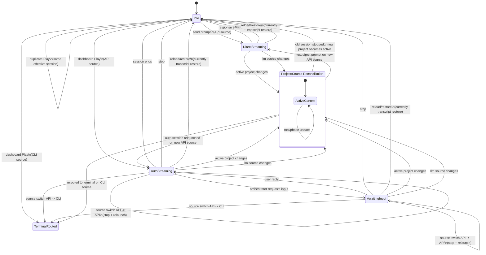

# sim-flow VS Code Transition Graph

## Overview

This diagram is a compact view of the panel/dashboard lifecycle that
the mocked regression harness is exercising. It focuses on the
transition-heavy edges where ownership, routing, or visible context can
change while work is already in flight.

Read this together with:

- [testing-plan.md](./testing-plan.md)
- [mode-switching.md](./mode-switching.md)

## Session Graph

## Intent

This graph encodes the current product decisions:

- dashboard and chat panel share one active project
- project switch implicitly stops the old session
- source switch stops the old session and relaunches or reroutes
- duplicate Play in the same effective session is a no-op
- reload currently restores transcript state, with true live reattach
  as a future target

## Current Coverage Themes

- direct reply lifecycle: stop, reload, project switch, source switch,
  immediate re-prompt
- auto session lifecycle: stop, relaunch, awaiting-input, source
  switch, project switch
- restore behavior: interrupted direct replies, interrupted auto
  sessions, delayed persistence writes, project-specific transcript
  isolation
- race handling: repeated Stop, duplicate Play, source switch plus
  immediate Play, project switch plus immediate Play

## Gaps To Keep In View

- true live session reattachment after reload
- deeper CLI-mode lifecycle graph and tests
- manual VS Code shell behaviors such as panel focus and placement
